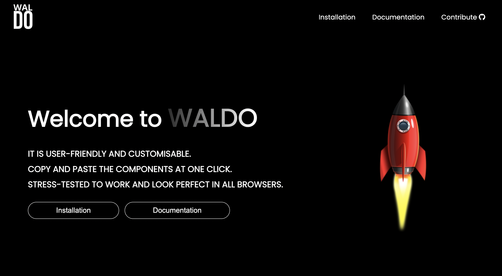

# WALDO

WALDO is a Component Library that makes your website come to life faster and make more
attractive.

# Installation Steps

Include CSS file mentioned in [installation section](https://waldo-ui.netlify.app/pages/install.html) in your head tag of html file.
You are ready to use this file.

# Tech Stack
- HTML
- CSS
- JavaScript

***Glad to see you here! Show some love by [starring](https://github.com/pariyar07/WALDO) this repo.***

